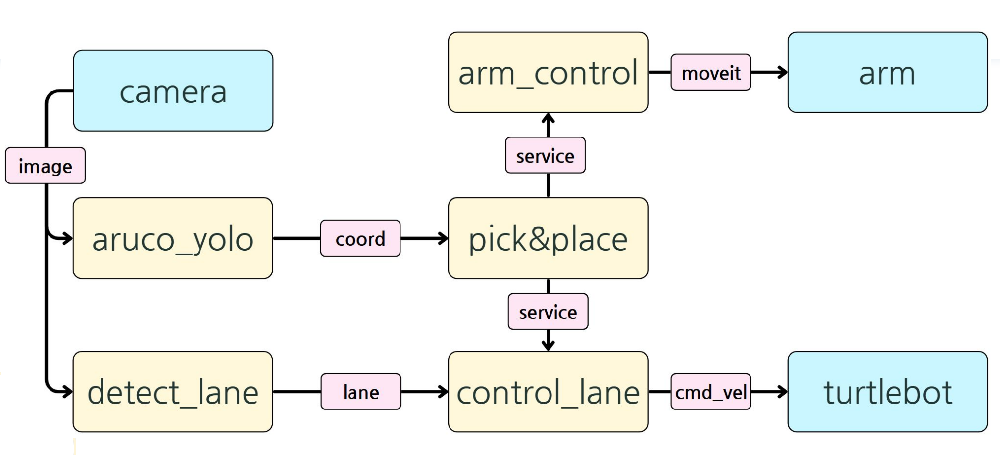

# 📌 TurtleBot3 Manipulator & Line-tracing Project

> **K-Digital Training 프로젝트**  
> 터틀봇3 와플(Waffle)에 매니퓰레이터를 부착하여 라인트레이싱, ArUco 마커 인식, 좌표 변환, MoveIt 기반 조작, Depth 추정 등 다양한 기능을 통합한 프로젝트입니다.

---

## 📁 프로젝트 구성
- `aruco/`: ArUco 마커 인식 및 Pick-and-Place 관련 코드
- `detect_lane_ori.py`: 차선 인식 및 상태 판단 로직
- `control_lane_finall.py`: 라인트레이싱 메인 제어 코드
- `gray_img_pub.py`: 흑백 영상 변환 및 퍼블리시
- `turtlebot_arm_controller.cpp`: 매니퓰레이터 제어 노드 (MoveIt 기반)

---

## ⚙️ 주요 기능

### 1. 라인트레이싱
- 흑백 영상 기반 차선 인식으로 빛 번짐 최소화
- 단일 차선/이중 차선 구분 알고리즘 적용
- 직선 vs 곡선 판단: 기울기 기반 + 슬라이딩 윈도우 보완

### 2. ArUco 마커 인식 및 좌표 변환
- 마커 중심좌표, Z-depth 계산
- camera_link → base_link 로 TF 변환
- TF-tree 확인 및 link 수정으로 정확도 향상

### 3. MoveIt 기반 Pick-and-Place
- ArUco 마커로부터 획득한 좌표를 사용해 매니퓰레이터 이동
- 초기 planning 실패 문제 → timeout & tolerance 조정으로 해결

---

## 🧪 문제 해결 및 최적화
- ArUco 인식 오류 → camera_link 연결 상태 점검 및 수정
- 차선 인식에서 H형 차선 병합 문제 → contour 개수 기반 분할
- planning 실패 → 시간/허용 오차 조정
- 흰색/노란색 차선 구분 문제 → 흰색 차선 통일

---

## 🖼 시스템 노드 구성도

프로젝트의 주요 노드 간 연결 구조는 다음과 같습니다:

---

## 📦 참고: 기반 패키지

본 프로젝트는 **TurtleBot3 공식 튜토리얼 패키지**를 기반으로,  
라인트레이싱, MoveIt 제어, ArUco 마커 인식 등의 기능을 통합하여 확장·변형한 프로젝트입니다.
